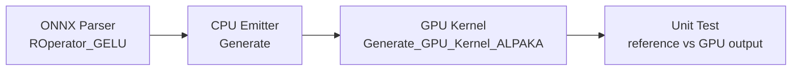
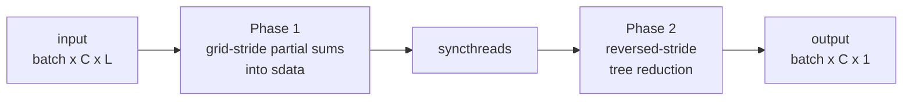
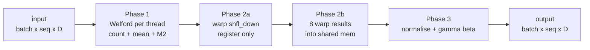
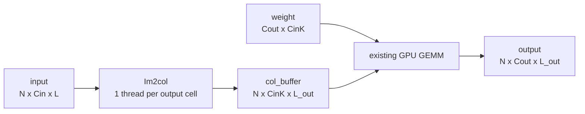

Pseudocode for four of the GPU operators I plan to implement during GSoC 2026.
I picked these four because they cover meaningfully different problems on the GPU side —
GELU is trivial to parallelize, ReduceSum requires careful shared memory use, LayerNorm
pushes that further with Welford + warp shuffles, and Conv1D is where I avoid writing a
hard kernel altogether by reformulating it as a GEMM.

All kernels are written against the [alpaka](https://github.com/alpaka-group/alpaka)
abstraction so the same source builds for CUDA and HIP.

---

## 1. GELU

GELU is used in Particle Transformer and the transformer model I'm planning to validate
at the end of GSoC. The formula is:

$$\text{GELU}(x) = x \cdot \frac{1}{2}\left(1 + \tanh\!\left(\sqrt{\tfrac{2}{\pi}}\,(x + 0.044715\,x^3)\right)\right)$$

Since every output element only depends on its own input, each thread handles one element
independently. No shared memory, no synchronization — the GPU just needs to keep all the
threads busy and make sure memory accesses are coalesced.



*Thread layout — excalidraw diagram to be added: flat row of input elements, one thread
per element, one-to-one arrows down to output. Block boundaries marked every 256 threads.*

```cpp
struct GELUKernel {
    template <typename TAcc>
    ALPAKA_FN_ACC void operator()(
        TAcc const& acc,
        float const* input,
        float*       output,
        size_t const N
    ) const {
        size_t const i =
            alpaka::getIdx<alpaka::Grid, alpaka::Threads>(acc)[0u];

        if (i >= N) return;

        float const x = input[i];

        // tanh approximation, same as PyTorch's default GELU
        constexpr float kA = 0.7978845608f; // sqrt(2/pi)
        constexpr float kB = 0.044715f;

        float const inner = kA * (x + kB * x * x * x);
        output[i] = x * 0.5f * (1.0f + alpaka::math::tanh(acc, inner));
    }
};

void launch_gelu(float const* d_in, float* d_out, size_t N) {
    constexpr size_t kBlock = 256;
    auto workDiv = WorkDiv1D{ (N + kBlock - 1) / kBlock, 1, kBlock };
    alpaka::exec<TAcc>(queue, workDiv, GELUKernel{}, d_in, d_out, N);
}
```

---

## 2. ReduceSum / ReduceMean

Used in section 2.2 and also needed internally for GroupNorm.

The naive approach — one thread loops over all L elements — leaves almost every GPU thread
sitting idle. The standard fix is a tree reduction: each step halves the number of active
threads and halves the remaining work, so L elements get reduced in O(log L) steps.

The subtlety is in how you index into shared memory. If threads access sdata with stride
1, 2, 4, … (i.e. the stride grows), multiple threads end up hitting the same memory bank
and serialise. Reversing the pattern — start at stride blockDim/2 and halve — keeps active
threads at consecutive indices so there are no bank conflicts.



*Thread layout — excalidraw diagram to be added: 8 shared memory slots with example values,
three reduction steps shown as arrows collapsing from right to left (stride 4 → 2 → 1),
slots that go idle greyed out after each step, final value in slot 0.*

```cpp
struct ReduceSumKernel {
    template <typename TAcc>
    ALPAKA_FN_ACC void operator()(
        TAcc const& acc,
        float const* input,
        float*       output,
        size_t const L,
        size_t const total_rows,
        bool   const compute_mean
    ) const {
        constexpr size_t kBlock = 256;
        auto& sdata = alpaka::declareSharedVar<float[kBlock]>(acc);

        size_t const tid      = alpaka::getIdx<alpaka::Block, alpaka::Threads>(acc)[0u];
        size_t const row      = alpaka::getIdx<alpaka::Grid,  alpaka::Blocks >(acc)[0u];
        size_t const blockDim = alpaka::getWorkDiv<alpaka::Block, alpaka::Threads>(acc)[0u];

        if (row >= total_rows) return;

        // each thread accumulates its slice — handles L > blockDim without a second kernel
        float partial = 0.0f;
        for (size_t i = tid; i < L; i += blockDim)
            partial += input[row * L + i];
        sdata[tid] = partial;
        alpaka::syncBlockThreads(acc);

        // reversed-stride tree reduction over shared memory
        for (size_t stride = blockDim / 2; stride > 0; stride >>= 1) {
            if (tid < stride)
                sdata[tid] += sdata[tid + stride];
            alpaka::syncBlockThreads(acc);
        }

        if (tid == 0) {
            float res = sdata[0];
            if (compute_mean) res /= float(L);
            output[row] = res;
            // TODO: rows longer than one block need atomicAdd here
        }
    }
};
```

---

## 3. LayerNorm (Welford)

Used in the transformer validation model.

The obvious implementation reads the row twice — once for the mean, once for the variance.
Welford's algorithm folds both into a single pass, which halves the memory traffic. It's also
numerically more stable than computing `Σx² − nμ²` directly, which loses precision when the
values are large and tightly clustered.

Once each thread has a partial `(count, mean, M2)`, I use `shfl_down` to merge within each
warp entirely in registers. Only after that do I write one float per warp into shared memory
for the final cross-warp merge. For a 256-thread block that's 8 shared memory slots total,
compared to 256 if you went straight to shared memory.



*Thread layout — excalidraw diagram to be added: 256 threads shown as 8 rows of 32 (the warps).
Phase 2a: collapse arrows within each warp row for shfl_down offsets 16→8→4→2→1, label "registers only".
Phase 2b: 8 lane-0 values drop into shared mem strip, another collapse to one value.
Phase 3: broadcasts back and all threads write output.*

```cpp
// warp-level Welford merge using register shuffles
template <typename TAcc>
ALPAKA_FN_ACC void warp_welford(
    TAcc const& acc, float& count, float& mean, float& M2)
{
    for (int off = 16; off > 0; off >>= 1) {
        float cb  = alpaka::warp::shfl_down(acc, count, off);
        float mb  = alpaka::warp::shfl_down(acc, mean,  off);
        float m2b = alpaka::warp::shfl_down(acc, M2,    off);

        float n = count + cb;
        float d = mb - mean;
        mean  = (count * mean + cb * mb) / (n + 1e-30f);
        M2   += m2b + d * d * count * cb / (n + 1e-30f);
        count = n;
    }
}

struct LayerNormKernel {
    template <typename TAcc>
    ALPAKA_FN_ACC void operator()(
        TAcc const& acc,
        float const* input, float* output,
        float const* gamma, float const* beta,
        size_t const D, size_t const rows, float const eps
    ) const {
        constexpr size_t kBlock = 256;
        constexpr size_t kWarps = kBlock / 32; // 8

        auto& sc = alpaka::declareSharedVar<float[kWarps]>(acc);
        auto& sm = alpaka::declareSharedVar<float[kWarps]>(acc);
        auto& sv = alpaka::declareSharedVar<float[kWarps]>(acc);

        size_t const tid  = alpaka::getIdx<alpaka::Block, alpaka::Threads>(acc)[0u];
        size_t const row  = alpaka::getIdx<alpaka::Grid,  alpaka::Blocks >(acc)[0u];
        size_t const lane = tid % 32;
        size_t const warp = tid / 32;

        if (row >= rows) return;
        float const* xr = input  + row * D;
        float*       yr = output + row * D;

        // single-pass Welford: d1 uses mean before update, M2 uses mean after
        float count = 0, mean = 0, M2 = 0;
        for (size_t i = tid; i < D; i += kBlock) {
            float x = xr[i]; count += 1;
            float d1 = x - mean; mean += d1 / count;
            M2 += d1 * (x - mean);
        }

        warp_welford(acc, count, mean, M2);
        if (lane == 0) { sc[warp]=count; sm[warp]=mean; sv[warp]=M2; }
        alpaka::syncBlockThreads(acc);

        if (warp == 0) {
            count = lane < kWarps ? sc[lane] : 0;
            mean  = lane < kWarps ? sm[lane] : 0;
            M2    = lane < kWarps ? sv[lane] : 0;
            warp_welford(acc, count, mean, M2);
        }

        auto& s_mu  = alpaka::declareSharedVar<float>(acc);
        auto& s_inv = alpaka::declareSharedVar<float>(acc);
        if (tid == 0) {
            s_mu  = mean;
            s_inv = alpaka::math::rsqrt(acc, M2 / float(D) + eps);
        }
        alpaka::syncBlockThreads(acc);

        float mu = s_mu, inv = s_inv;
        for (size_t i = tid; i < D; i += kBlock)
            yr[i] = gamma[i] * (xr[i] - mu) * inv + beta[i];
    }
};
```

---

## 4. Conv1D via Im2col + GEMM

Needed for ParticleNet.

Writing a direct Conv1D kernel that tiles correctly over input channels, kernel positions,
stride, and dilation at the same time is doable but painful to get right and even harder
to tune. The standard approach in frameworks like cuDNN is to reformulate it: reshape the
input so that each convolution window becomes a column of a matrix, then call GEMM on the
result. SOFIE already has a GPU GEMM kernel, so I only need to write the reshape step.

The reshape (Im2col) is itself trivial to parallelize — every output cell of the column
matrix is independent, so one thread per cell works fine.



*Thread layout — excalidraw diagram to be added: 3D input block [N, Cin, L] with an arrow
into a 2D matrix [Cin·K, L_out]. Zoom into one column showing the sliding window of K elements
it pulls from the input, annotated with `l_in = l_out * stride + k * dilation - pad`.
Thread bubble on each matrix cell. Note: out-of-bounds writes 0 (implicit padding).*

```cpp
struct Im2ColKernel {
    template <typename TAcc>
    ALPAKA_FN_ACC void operator()(
        TAcc const& acc,
        float const* input,   // [N, Cin, L]
        float*       col_buf, // [N, Cin*K, L_out]
        int N, int Cin, int L, int K, int L_out,
        int stride, int dilation, int pad
    ) const {
        int const CK  = Cin * K;
        int const gid = alpaka::getIdx<alpaka::Grid, alpaka::Threads>(acc)[0u];
        if (gid >= N * CK * L_out) return;

        int const l_out = gid % L_out;
        int const ck    = (gid / L_out) % CK;
        int const n     = gid / (L_out * CK);

        int const cin  = ck / K;
        int const k    = ck % K;
        int const l_in = l_out * stride + k * dilation - pad;

        col_buf[n * CK * L_out + ck * L_out + l_out] =
            (l_in >= 0 && l_in < L) ? input[n * Cin * L + cin * L + l_in] : 0.0f;
    }
};

void launch_conv1d(float const* d_in, float const* d_w,
                   float const* d_bias, float* d_out,
                   int N, int Cin, int Cout, int L, int K,
                   int stride, int dilation, int pad)
{
    int const L_out = (L + 2*pad - dilation*(K-1) - 1) / stride + 1;
    int const CK    = Cin * K;

    float* d_col = alpaka::allocBuf<float>(dev, N * CK * L_out);

    int const total = N * CK * L_out;
    auto wd = WorkDiv1D{ (total + 255) / 256, 1, 256 };
    alpaka::exec<TAcc>(queue, wd, Im2ColKernel{},
                       d_in, d_col, N, Cin, L, K, L_out,
                       stride, dilation, pad);

    // one GEMM per batch element — reuses existing SOFIE GPU MatMul
    for (int n = 0; n < N; ++n)
        launch_matmul(d_w,
                      d_col + n * CK   * L_out,
                      d_out + n * Cout * L_out,
                      Cout, CK, L_out);

    if (d_bias) launch_add_bias(d_out, d_bias, N, Cout, L_out);

    alpaka::freeBuf(dev, d_col);
}
```