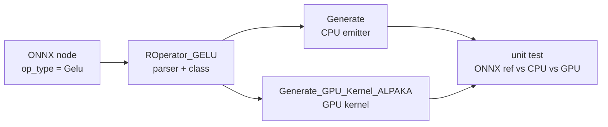
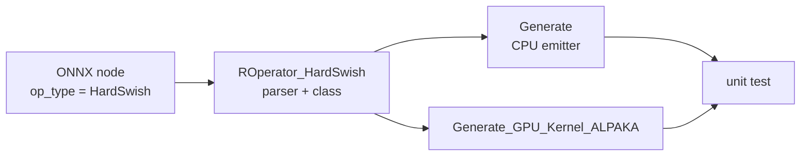
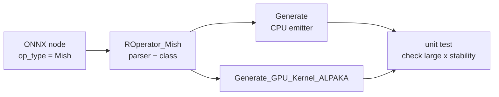
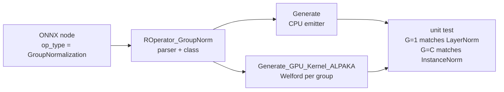
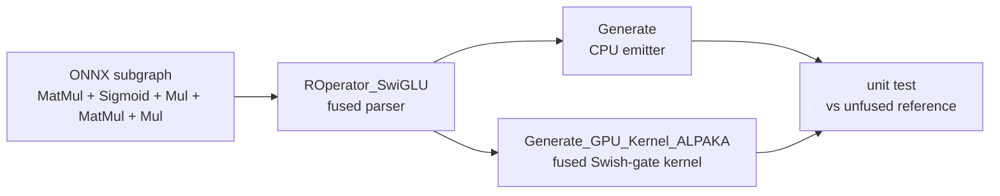

Pseudocode for the five fullstack operators I plan to implement during GSoC 2026.
Fullstack here means each one needs an ONNX parser, ROperator class, CPU emitter,
alpaka GPU kernel, unit test, and reference output — none of them exist in the codebase yet.

The GPU kernels are written against [alpaka](https://github.com/alpaka-group/alpaka)
so the same source builds for CUDA and HIP with just a compiler flag swap.

---

## 1. GELU

$$\text{GELU}(x) = x \cdot \frac{1}{2}\left(1 + \tanh\!\left(\sqrt{\tfrac{2}{\pi}}\,(x + 0.044715\,x^3)\right)\right)$$

Used in Particle Transformer and the transformer model I'm planning to validate end-to-end.
The tanh approximation above is what PyTorch uses by default and is what most ONNX exporters
will emit, so that's what I'm implementing. The exact form (`0.5 * x * erfc(...)`) exists
as a separate ONNX op and doesn't need special-casing here.

Each output depends only on its own input so there's nothing to coordinate between threads —
one thread per element, coalesced reads and writes, that's it.



*Excalidraw — flat row of N input boxes, matching row of thread boxes T0…T_{N-1} below,
one-to-one arrows down to output. Block boundary marked every 256 threads.*

```cpp
struct GELUKernel {
    template <typename TAcc>
    ALPAKA_FN_ACC void operator()(
        TAcc const& acc,
        float const* input,
        float*       output,
        size_t const N
    ) const {
        size_t const i =
            alpaka::getIdx<alpaka::Grid, alpaka::Threads>(acc)[0u];
        if (i >= N) return;

        float const x  = input[i];
        constexpr float kA = 0.7978845608f; // sqrt(2/pi)
        constexpr float kB = 0.044715f;

        // tanh approximation — matches PyTorch default and standard ONNX export
        output[i] = x * 0.5f *
                    (1.0f + alpaka::math::tanh(acc, kA * (x + kB * x * x * x)));
    }
};

void launch_gelu(float const* d_in, float* d_out, size_t N) {
    constexpr size_t kBlock = 256;
    auto wd = WorkDiv1D{ (N + kBlock - 1) / kBlock, 1, kBlock };
    alpaka::exec<TAcc>(queue, wd, GELUKernel{}, d_in, d_out, N);
}
```

**CPU emitter (inside `Generate()`):**

```cpp
// emitted into the generated header as inline C++
out << "for (size_t i = 0; i < fNSize; ++i) {\n";
out << "  float x = tensor_" << fNX << "[i];\n";
out << "  constexpr float kA = 0.7978845608f;\n";
out << "  constexpr float kB = 0.044715f;\n";
out << "  tensor_" << fNY << "[i] = x * 0.5f * (1.0f + std::tanh(kA*(x + kB*x*x*x)));\n";
out << "}\n";
```

**Unit test sketch:**

```cpp
// generate reference with numpy: 0.5*x*(1+np.tanh(np.sqrt(2/np.pi)*(x+0.044715*x**3)))
// run same input through SOFIE CPU emitter and GPU kernel
// compare outputs within tolerance 1e-5
EXPECT_NEAR(cpu_out[i], ref_out[i], 1e-5);
EXPECT_NEAR(gpu_out[i], ref_out[i], 1e-5);
```

---

## 2. HardSwish

$$\text{HardSwish}(x) = x \cdot \frac{\text{ReLU6}(x + 3)}{6}$$

Used in EfficientNet. It's a cheaper approximation of Swish (`x * sigmoid(x)`) that avoids
the exponential — MobileNetV3 introduced it specifically because it's fast on hardware that
doesn't have a native sigmoid instruction. The GPU kernel is straightforward, but the
formula needs careful handling at the boundaries: it's exactly 0 for x ≤ −3 and exactly x
for x ≥ 3, so the ReLU6 clamp has to be right.



*Excalidraw — same one-to-one thread layout as GELU. Annotate the two boundary cases:
x ≤ −3 → output 0, x ≥ 3 → output x, middle region → x*(x+3)/6.*

```cpp
struct HardSwishKernel {
    template <typename TAcc>
    ALPAKA_FN_ACC void operator()(
        TAcc const& acc,
        float const* input,
        float*       output,
        size_t const N
    ) const {
        size_t const i =
            alpaka::getIdx<alpaka::Grid, alpaka::Threads>(acc)[0u];
        if (i >= N) return;

        float const x = input[i];

        // clamp(x+3, 0, 6) / 6 — avoids a branch, branchless on GPU
        float const inner = alpaka::math::min(acc,
                                alpaka::math::max(acc, x + 3.0f, 0.0f),
                                6.0f);
        output[i] = x * inner / 6.0f;
    }
};

void launch_hardswish(float const* d_in, float* d_out, size_t N) {
    constexpr size_t kBlock = 256;
    auto wd = WorkDiv1D{ (N + kBlock - 1) / kBlock, 1, kBlock };
    alpaka::exec<TAcc>(queue, wd, HardSwishKernel{}, d_in, d_out, N);
}
```

**CPU emitter:**

```cpp
out << "for (size_t i = 0; i < fNSize; ++i) {\n";
out << "  float x = tensor_" << fNX << "[i];\n";
out << "  float inner = std::min(std::max(x + 3.0f, 0.0f), 6.0f);\n";
out << "  tensor_" << fNY << "[i] = x * inner / 6.0f;\n";
out << "}\n";
```

**Unit test sketch:**

```cpp
// boundary checks are important here
// x = -4  → expect 0
// x =  4  → expect 4
// x =  1  → expect 1*(1+3)/6 = 4/6
EXPECT_NEAR(gpu_out[boundary_idx], ref_out[boundary_idx], 1e-5);
```

---

## 3. Mish

$$\text{Mish}(x) = x \cdot \tanh\!\left(\ln(1 + e^x)\right)$$

Used in YOLO v4 and later. The formula is `x * tanh(softplus(x))`. The numerical issue here
is that for large x, `log(1 + exp(x))` overflows in float32 — `exp(x)` hits inf around x=88.
The standard fix is to use the identity `log(1 + exp(x)) = x + log(1 + exp(-x))` for x > 20,
which stays numerically stable. This is the same trick PyTorch uses internally.



*Excalidraw — one-to-one thread layout. Annotate the two code paths: x > 20 uses the
stable form `x + log(1 + exp(-x))`, x ≤ 20 uses `log(1 + exp(x))` directly.*

```cpp
struct MishKernel {
    template <typename TAcc>
    ALPAKA_FN_ACC void operator()(
        TAcc const& acc,
        float const* input,
        float*       output,
        size_t const N
    ) const {
        size_t const i =
            alpaka::getIdx<alpaka::Grid, alpaka::Threads>(acc)[0u];
        if (i >= N) return;

        float const x = input[i];

        // numerically stable softplus: avoids overflow for large x
        float const sp = (x > 20.0f)
            ? x + alpaka::math::log(acc, 1.0f + alpaka::math::exp(acc, -x))
            : alpaka::math::log(acc, 1.0f + alpaka::math::exp(acc,  x));

        output[i] = x * alpaka::math::tanh(acc, sp);
    }
};

void launch_mish(float const* d_in, float* d_out, size_t N) {
    constexpr size_t kBlock = 256;
    auto wd = WorkDiv1D{ (N + kBlock - 1) / kBlock, 1, kBlock };
    alpaka::exec<TAcc>(queue, wd, MishKernel{}, d_in, d_out, N);
}
```

**CPU emitter:**

```cpp
out << "for (size_t i = 0; i < fNSize; ++i) {\n";
out << "  float x = tensor_" << fNX << "[i];\n";
out << "  float sp = (x > 20.0f)\n";
out << "    ? x + std::log(1.0f + std::exp(-x))\n";
out << "    : std::log(1.0f + std::exp(x));\n";
out << "  tensor_" << fNY << "[i] = x * std::tanh(sp);\n";
out << "}\n";
```

**Unit test sketch:**

```cpp
// specifically test large-x stability — this is where naive impls break
std::vector<float> edge_cases = {-100.f, -20.f, 0.f, 20.f, 100.f};
for (float x : edge_cases)
    EXPECT_FALSE(std::isnan(gpu_out[idx]));
EXPECT_NEAR(gpu_out[i], ref_out[i], 1e-4); // slightly looser — transcendental ops
```

---

## 4. Group Normalization

$$\text{GroupNorm}(x) = \frac{x - \mu_g}{\sqrt{\sigma_g^2 + \varepsilon}} \cdot \gamma + \beta$$

where μ_g and σ_g² are computed per group, not per channel or per full feature vector.

Used in diffusion models. GroupNorm sits between LayerNorm (normalises all channels) and
InstanceNorm (normalises each channel separately) — it splits the C channels into G groups
and normalises within each group independently. The GPU strategy is the same Welford +
warp-shuffle approach as LayerNorm, just with a different assignment of blocks to groups.
Each block handles one `(batch, group)` pair, reducing over `C/G * H * W` elements.

The kernel is structurally very close to the LayerNorm kernel I already have, which is
intentional — I'd rather reuse a tested reduction path than write a new one.



*Excalidraw — input tensor [N, C, L] split into G horizontal strips (the groups). Each strip
gets its own block. Inside one block, show the same warp-shuffle collapse as LayerNorm.
Annotate: "block = one (n, g) pair, reduces over C/G * L elements".*

```cpp
struct GroupNormKernel {
    template <typename TAcc>
    ALPAKA_FN_ACC void operator()(
        TAcc const& acc,
        float const* input,   // [N, C, L]
        float*       output,  // [N, C, L]
        float const* gamma,   // [C]
        float const* beta,    // [C]
        int N, int C, int L,
        int G,                // number of groups, C % G == 0
        float eps
    ) const {
        // one block per (batch, group) pair
        int const n     = alpaka::getIdx<alpaka::Grid, alpaka::Blocks>(acc)[0u] / G;
        int const g     = alpaka::getIdx<alpaka::Grid, alpaka::Blocks>(acc)[0u] % G;
        int const tid   = alpaka::getIdx<alpaka::Block, alpaka::Threads>(acc)[0u];

        if (n >= N) return;

        int const cPerG  = C / G;
        int const gSize  = cPerG * L;          // elements this block reduces over
        int const gStart = g * cPerG;          // first channel in this group

        constexpr int kBlock = 256;
        constexpr int kWarps = kBlock / 32;
        auto& sc = alpaka::declareSharedVar<float[kWarps]>(acc);
        auto& sm = alpaka::declareSharedVar<float[kWarps]>(acc);
        auto& sv = alpaka::declareSharedVar<float[kWarps]>(acc);

        int const lane = tid % 32;
        int const warp = tid / 32;

        // phase 1: Welford over all elements in this group
        float count = 0, mean = 0, M2 = 0;
        for (int idx = tid; idx < gSize; idx += kBlock) {
            int const c   = gStart + idx / L;
            int const l   = idx % L;
            float const x = input[n * C * L + c * L + l];
            count += 1;
            float d1 = x - mean; mean += d1 / count;
            M2 += d1 * (x - mean);
        }

        // phase 2: same warp-shuffle + shared-mem reduction as LayerNorm
        warp_welford(acc, count, mean, M2);
        if (lane == 0) { sc[warp]=count; sm[warp]=mean; sv[warp]=M2; }
        alpaka::syncBlockThreads(acc);

        if (warp == 0) {
            count = lane < kWarps ? sc[lane] : 0;
            mean  = lane < kWarps ? sm[lane] : 0;
            M2    = lane < kWarps ? sv[lane] : 0;
            warp_welford(acc, count, mean, M2);
        }

        auto& s_mu  = alpaka::declareSharedVar<float>(acc);
        auto& s_inv = alpaka::declareSharedVar<float>(acc);
        if (tid == 0) {
            s_mu  = mean;
            s_inv = alpaka::math::rsqrt(acc, M2 / float(gSize) + eps);
        }
        alpaka::syncBlockThreads(acc);

        // phase 3: normalise — each thread writes back its slice
        float mu = s_mu, inv = s_inv;
        for (int idx = tid; idx < gSize; idx += kBlock) {
            int const c = gStart + idx / L;
            int const l = idx % L;
            int const flat = n * C * L + c * L + l;
            output[flat] = gamma[c] * (input[flat] - mu) * inv + beta[c];
        }
    }
};

void launch_groupnorm(float const* d_in, float* d_out,
                      float const* d_gamma, float const* d_beta,
                      int N, int C, int L, int G, float eps)
{
    int const gridSize = N * G;
    auto wd = WorkDiv1D{ size_t(gridSize), 1, 256 };
    alpaka::exec<TAcc>(queue, wd, GroupNormKernel{},
                       d_in, d_out, d_gamma, d_beta, N, C, L, G, eps);
}
```

**CPU emitter:**

```cpp
out << "int cPerG = " << fC << " / " << fG << ";\n";
out << "for (int n = 0; n < " << fN << "; ++n) {\n";
out << "  for (int g = 0; g < " << fG << "; ++g) {\n";
out << "    float mean = 0, var = 0;\n";
out << "    int gStart = g * cPerG;\n";
out << "    for (int c = gStart; c < gStart+cPerG; ++c)\n";
out << "      for (int l = 0; l < " << fL << "; ++l)\n";
out << "        mean += tensor_" << fNX << "[n*C*L + c*L + l];\n";
out << "    mean /= float(cPerG * " << fL << ");\n";
out << "    // variance pass (two-pass is fine for CPU)\n";
out << "    for (int c = gStart; c < gStart+cPerG; ++c)\n";
out << "      for (int l = 0; l < " << fL << "; ++l) {\n";
out << "        float d = tensor_" << fNX << "[n*C*L+c*L+l] - mean;\n";
out << "        var += d*d;\n";
out << "      }\n";
out << "    var /= float(cPerG * " << fL << ");\n";
out << "    float inv = 1.0f / std::sqrt(var + " << fEps << "f);\n";
out << "    for (int c = gStart; c < gStart+cPerG; ++c)\n";
out << "      for (int l = 0; l < " << fL << "; ++l) {\n";
out << "        int flat = n*C*L + c*L + l;\n";
out << "        tensor_" << fNY << "[flat] = gamma[c]*(tensor_" << fNX << "[flat]-mean)*inv + beta[c];\n";
out << "      }\n";
out << "  }\n}\n";
```

**Unit test sketch:**

```cpp
// G=1 should match LayerNorm over the full channel dim
// G=C should match InstanceNorm (one channel per group)
// run both sanity checks before comparing against ONNX reference
EXPECT_NEAR(groupnorm_g1[i], layernorm_ref[i], 1e-4);
EXPECT_NEAR(gpu_out[i], cpu_out[i], 1e-4);
```

---

## 5. SwiGLU

$$\text{SwiGLU}(X, W, V, b, c) = \text{Swish}(X W + b) \otimes (X V + c)$$

Used in LLaMA, PaLM, and most recent transformer variants. SwiGLU is a gated activation:
it computes two linear projections of the input, applies Swish to one, then multiplies them
element-wise. In practice almost every implementation fuses the two projections into a single
weight matrix and splits the output in half — that's what the LLaMA architecture does and
what the ONNX export will look like.

The interesting GPU problem here is that this is a fused operator. I could implement it as
`Linear → Swish → Linear → Mul`, but that would write three intermediate tensors to global
memory and read them back. Fusing everything into one kernel means the intermediate values
stay in registers and only the final output touches global memory.

The two projections (`gate` and `up`) are computed as GEMMs — those reuse the existing SOFIE
GPU MatMul. Only the element-wise fused part (Swish on gate, then gate * up) needs a new
kernel.



*Excalidraw — input X on the left. Two arrows go right to W_gate and W_up (the two weight
matrices, drawn as rectangles). Both GEMMs produce intermediate tensors gate and up of shape
[N, d_ff]. Then a fused kernel box takes both, applies sigmoid(gate)*gate element-wise, and
multiplies by up. Show that gate and up stay in registers inside the fused kernel — annotate
"no global write for intermediates".*

```cpp
// fused kernel: takes gate and up projections, outputs gate * swish(up) in one pass
// gate and up are [N, d_ff] after the two GEMMs
struct SwiGLUFusedKernel {
    template <typename TAcc>
    ALPAKA_FN_ACC void operator()(
        TAcc const& acc,
        float const* gate,   // [N * d_ff] — result of X @ W_gate + b_gate
        float const* up,     // [N * d_ff] — result of X @ W_up   + b_up
        float*       output, // [N * d_ff]
        size_t const M       // N * d_ff
    ) const {
        size_t const i =
            alpaka::getIdx<alpaka::Grid, alpaka::Threads>(acc)[0u];
        if (i >= M) return;

        float const g = gate[i];
        float const u = up[i];

        // Swish(g) = g * sigmoid(g) — stays in registers, never written to global mem
        float const swish_g = g / (1.0f + alpaka::math::exp(acc, -g));

        output[i] = swish_g * u;
    }
};

void launch_swiglu(float const* d_x,
                   float const* d_Wgate, float const* d_bgate,
                   float const* d_Wup,   float const* d_bup,
                   float*       d_out,
                   int N, int d_model, int d_ff)
{
    // step 1: two GEMMs — reuse existing SOFIE GPU MatMul
    float* d_gate = alpaka::allocBuf<float>(dev, N * d_ff);
    float* d_up   = alpaka::allocBuf<float>(dev, N * d_ff);

    launch_matmul(d_x, d_Wgate, d_gate, N, d_model, d_ff);
    if (d_bgate) launch_add_bias(d_gate, d_bgate, N, d_ff, 1);

    launch_matmul(d_x, d_Wup,   d_up,   N, d_model, d_ff);
    if (d_bup)   launch_add_bias(d_up,   d_bup,   N, d_ff, 1);

    // step 2: fused Swish(gate) * up — one kernel, intermediates stay in registers
    size_t const M = size_t(N) * d_ff;
    constexpr size_t kBlock = 256;
    auto wd = WorkDiv1D{ (M + kBlock - 1) / kBlock, 1, kBlock };
    alpaka::exec<TAcc>(queue, wd, SwiGLUFusedKernel{},
                       d_gate, d_up, d_out, M);

    alpaka::freeBuf(dev, d_gate);
    alpaka::freeBuf(dev, d_up);
}
```

**CPU emitter:**

```cpp
// CPU emitter generates the two matmuls inline, then the fused element-wise loop
out << "// gate projection\n";
out << "MatMul(tensor_" << fNX << ", tensor_" << fNWgate
    << ", tensor_gate, " << fN << ", " << fDModel << ", " << fDff << ");\n";
out << "// up projection\n";
out << "MatMul(tensor_" << fNX << ", tensor_" << fNWup
    << ", tensor_up, "  << fN << ", " << fDModel << ", " << fDff << ");\n";
out << "// fused Swish(gate) * up\n";
out << "for (size_t i = 0; i < " << fN * fDff << "ull; ++i) {\n";
out << "  float g = tensor_gate[i];\n";
out << "  tensor_" << fNY << "[i] = (g / (1.0f + std::exp(-g))) * tensor_up[i];\n";
out << "}\n";
```

**Unit test sketch:**

```cpp
// unfused reference: compute gate, up separately, apply swish, multiply
// compare against fused GPU output — should match within 1e-5
// also check that output shape is [N, d_ff], not [N, 2*d_ff]
EXPECT_EQ(gpu_output.size(), size_t(N * d_ff));
EXPECT_NEAR(gpu_out[i], unfused_ref[i], 1e-5);
```